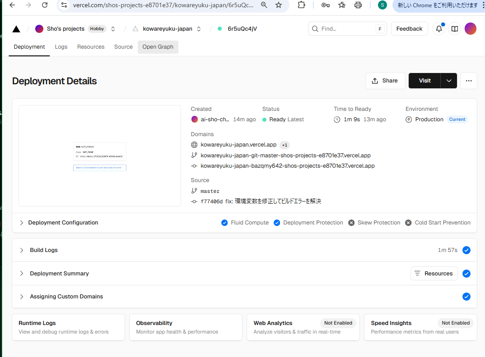

# デプロイ関連スクショ

次の2枚のスクリーンショットを `docs/screenshots/` に配置してください。Claude Code はこのMarkdownから相対パスで参照できます。

- Vercel Deployment Details → `docs/screenshots/vercel-deploy-details.png`
- Vercel 404 Page → `docs/screenshots/vercel-404.png`

